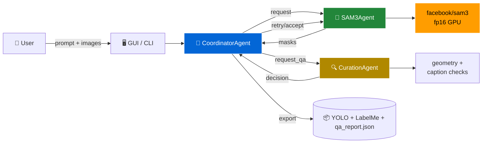
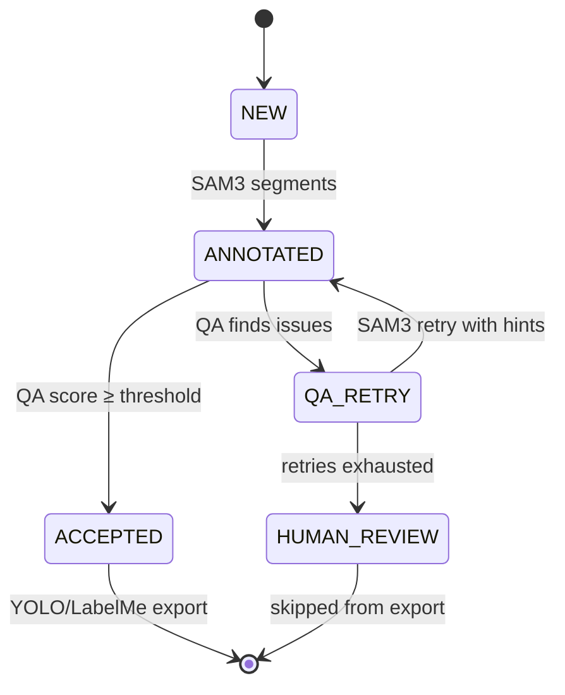

<div align="center">

<!-- Animated wave banner -->
<picture>
  <source media="(prefers-color-scheme: dark)" srcset="https://capsule-render.vercel.app/api?type=waving&color=gradient&customColorList=12,20,24,30&height=220&section=header&text=Agentic%20SAM3%20Lab&fontSize=58&fontColor=ffffff&animation=fadeIn&fontAlignY=38&desc=Multi-Agent%20Auto-Annotation%20with%20SAM%203%20%2B%20LLM%20QA&descAlignY=62&descSize=18">
  
</picture>

<!-- Typing animation -->
<a href="https://github.com/Rohit11-OG/Agentic-SAM3-Auto-Annotation-Lab">
  
</a>

<br/>

<p>
  
  
  
  
  
  
</p>

</div>

---

<table align="center" border="0">
<tr>
<td align="center" width="33%">
  <h3>🤖 Auto-Annotate</h3>
  Drop a folder.<br/>Agents detect, score, retry, accept.<br/>Zero clicks.
</td>
<td align="center" width="33%">
  <h3>🧠 Real SAM 3</h3>
  <code>facebook/sam3</code> on local GPU.<br/>fp16 on 6 GB VRAM.
</td>
<td align="center" width="33%">
  <h3>🎨 LabelMe-Style GUI</h3>
  Tabs · Hotkeys · Dark mode<br/>Polygon · Bbox · Edit · Undo
</td>
</tr>
</table>

---

## ✨ Highlights

```
┌──────────────────────────────────────────────────────────────────┐
│  •  Multi-agent chatroom:  SAM3Agent ⇄ CurationAgent ⇄ Coord     │
│  •  Real SAM 3 segmentation (HF facebook/sam3) — local + offline │
│  •  YOLO bbox + YOLO-seg polygon export                          │
│  •  LabelMe JSON read/write (compatible with Labelme app)        │
│  •  Tkinter GUI: Setup / Run Log / Results / Labeler tabs        │
│  •  CLI flags + interactive prompt parser ("annotate tanks")     │
│  •  ThreadPool, cancel, progress, qa_report.json, retry stats    │
└──────────────────────────────────────────────────────────────────┘
```

---

## 🏗 Architecture



---

## 🔄 Pipeline Flow



---

## 🚀 Quick Start

<details open>
<summary><b>Install</b></summary>

```bash
git clone https://github.com/Rohit11-OG/Agentic-SAM3-Auto-Annotation-Lab.git
cd "Agentic-SAM3-Auto-Annotation-Lab"

python -m venv .venv
.venv\Scripts\activate                # Windows
# source .venv/bin/activate           # macOS / Linux

pip install -e ".[dev]"

# Optional (real SAM3 on GPU):
pip install torch torchvision --index-url https://download.pytorch.org/whl/cu124
pip install transformers accelerate
```
</details>

<details>
<summary><b>Download SAM 3 weights (gated repo)</b></summary>

```bash
hf auth login                          # paste token from huggingface.co/settings/tokens
hf download facebook/sam3 --local-dir models\sam3
```

Edit `config/project_example.yaml`:

```yaml
sam3:
  backend: hf_local       # mock | sam3_api | hf_local
  local_dir: ./models/sam3
  device: auto
```
</details>

<details>
<summary><b>Run — CLI</b></summary>

```bash
python -m src.main --dataset D:\cars --output D:\cars_out --prompt "cars"
```
</details>

<details>
<summary><b>Run — GUI</b></summary>

```bash
python -m src.ui.review_app
```

Tabs: **Setup → Run Log → Results → Labeler**
</details>

---

## 🧪 Output Example

| File | What |
|---|---|
| `yolo_seg_labels/*.txt` | YOLO-seg polygons (one line per mask) |
| `classes.txt` | class index map |
| `qa_report.json` | per-class counts, accept rate, retry stats, top issues |
| `conversation_logs.json` | full agent chat transcript |
| `previews/*.seg.jpg` | original + mask overlay |

---

## 🖥 GUI — Feature Map

<table>
<tr>
<td><b>Setup</b></td>
<td>Config picker · Dataset browse · Output picker · Prompt history · Workers/retries spinners · Recent folders · Folder preview</td>
</tr>
<tr>
<td><b>Run Log</b></td>
<td>Live agent log color-coded (Coordinator / SAM3 / Curation) · Clear button · Auto-scroll</td>
</tr>
<tr>
<td><b>Results</b></td>
<td>QA summary · Label viewer · Filter (All/ACCEPTED/HUMAN_REVIEW) · Search · Image preview w/ zoom + pan · Save PNG · Export all</td>
</tr>
<tr>
<td><b>Labeler</b></td>
<td>LabelMe-style toolbar · Rect/Polygon/Edit modes · Vertex drag · Undo · Crosshair · SAM3 auto-assist · LabelMe JSON I/O</td>
</tr>
</table>

**Hotkeys:** `Ctrl+R` Run · `Ctrl+B` Browse · `Ctrl+T` Theme · `Esc` Cancel · `Ctrl+S` Save · `Ctrl+Z` Undo · `N`/`P` Next/Prev · `W`/`Y`/`E` Rect/Poly/Edit

---

## 📁 Project Structure

```
project/
├── config/project_example.yaml
├── data/{images,annotations_raw,annotations_final}/
├── docs/agent-spec.md
├── models/sam3/                          # .safetensors weights (gitignored)
├── notebooks/exploration.ipynb
├── src/
│   ├── main.py                           # CLI entry
│   ├── agents/                           # SAM3Agent · CurationAgent · CoordinatorAgent
│   ├── core/                             # models · orchestrator · config_loader
│   ├── tools/
│   │   ├── sam3/{client,hf_backend}.py
│   │   ├── yolo/exporter.py
│   │   ├── prompt_interpreter.py
│   │   ├── geometry.py
│   │   └── captioning.py
│   └── ui/                               # review_app · labeler · _helpers
└── tests/                                # 48 tests
```

---

## 🧰 Tech Stack

<div align="center">

| Layer | Tools |
|---|---|
| Vision | `facebook/sam3` · Pillow · OpenCV |
| ML | PyTorch 2.6 + CUDA 12.4 · Transformers 5.x |
| Agents | Pure Python · Pydantic v2 |
| GUI | Tkinter · ttk |
| Config | YAML |
| Tests | pytest |

</div>

---

## 📊 Stats

<div align="center">


</div>

---

## 🗺 Roadmap

- [x] Mock backend
- [x] `sam3_api` backend
- [x] `hf_local` backend (real SAM 3 weights)
- [x] YOLO bbox + YOLO-seg export
- [x] LabelMe JSON I/O
- [x] Multi-agent chatroom + retry
- [x] GUI with dark mode + 4 tabs
- [ ] COCO export
- [ ] Real LLM-based CurationAgent
- [ ] Point-prompt SAM3 (click to segment)
- [ ] Active learning loop

---

<div align="center">

<picture>
  <source media="(prefers-color-scheme: dark)" srcset="https://capsule-render.vercel.app/api?type=waving&color=gradient&customColorList=12,20,24,30&height=120&section=footer">
  
</picture>

<sub>Made with multi-agent magic · MIT License</sub>

</div>
